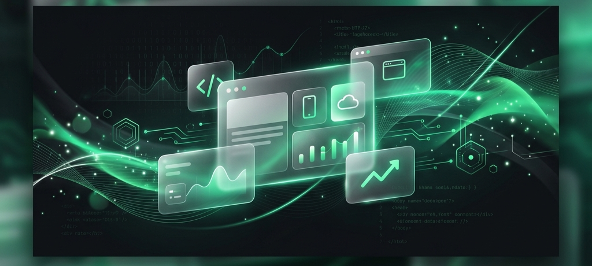

  <h1>CriaWeb 🍏💚🍋‍🟩</h1>
  
  
<strong>Vision, Services, and Portfolio by Henr. Ferreira Saraiva</strong>

  
  
  
  
  

 

  <a href="./README.md">English</a> | <a href="./README.pt-BR.md">Português</a>

## 🚀 About the Project
**CriaWeb** is a platform created to showcase and sell the freelance services of **Henrick Ferreira**. It focuses on helping stores, businesses, and clients who want to launch or scale their systems on the internet, specializing in **medium-sized fullstack applications**.

## 🛠 What I Build (Scope)
My work is strictly focused on **Fullstack Web Applications**. This includes:
- ✅ Complete Front-end and Back-end development.
- ✅ Implementation of extra layers on demand (structured logs, metrics, admin panels, etc).
- ✅ Integrations with APIs, third-party services, and infrastructure (Deploy).

**What I DO NOT build:**
- ❌ Native Desktop Applications.
- ❌ Native Mobile Applications (iOS/Android).
- ❌ Embedded Systems Software.

## 💰 Business Model & Pricing
Currently, I operate on a **custom quote model**, where the project cost is defined through direct negotiation. We will mutually agree on:
- The core software development cost.
- Secondary costs involving infrastructure, hosting, and external services.
*Note: In the future, the platform will feature fixed and tiered plans.*

## 📍 Location & Contact
I offer remote services and am also available for on-site visits in **Fortaleza, Ceará, Brazil**.
- **WhatsApp**: [Contact Me](#)
- **LinkedIn**: [Henrick Ferreira](#)
- **GitHub**: [@rickferrdev](https://github.com/rickferrdev)

## 💻 Tech Stack
This website is built with modern web development technologies:
- **React & Vite** - For a fast, reactive interface.
- **TanStack Router** - For efficient routing.
- **Tailwind CSS** - Elegant utility-first styling.
- **UI Components** - A custom, accessible, and beautiful component library.

## 📄 License & Code Usage
This project was built with the help of AI tools and is **Open Source with Attribution**. You are authorized to use, copy, and reuse the components of this site (such as cards, custom styles, interface logic).

> [!WARNING]
> **Mandatory Attribution Rule**
> To use parts of this project, you **must** include the authorship credits in the used component, making it accessible to users during interaction (via link, card, hover, tooltip, etc).
> 
> **Required format:** `By Henr. Ferreira - https://github.com/rickferrdev`

---

  Made with 💚 by <a href="https://github.com/rickferrdev">Henrick Ferreira</a>

